# Architecture

## System Overview

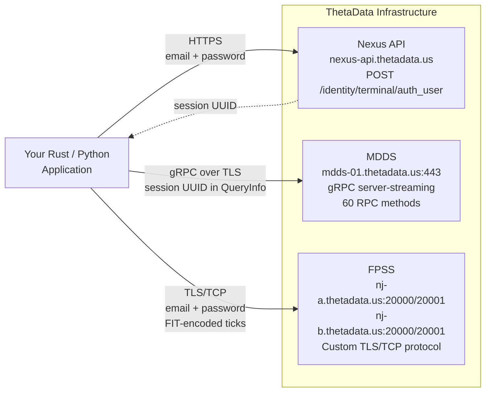

## Authentication Flow

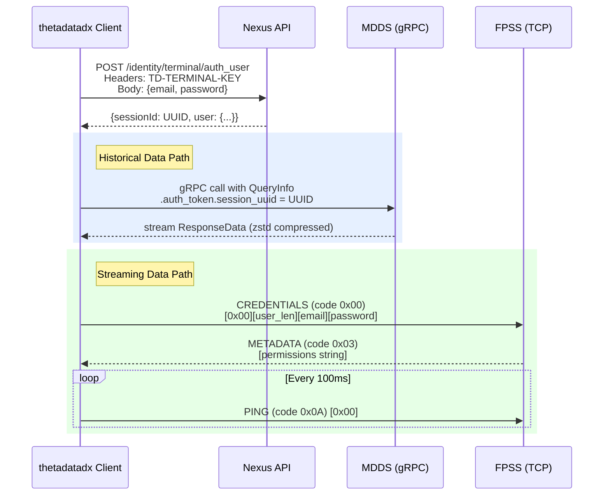

The terminal API key is a static UUID that identifies the terminal application, not the user. It ships in every copy of the Java terminal.

## MDDS Protocol (Historical Data)

MDDS is a standard gRPC service over TLS, operating on port 443.

### Service Definition

- **Package**: `BetaEndpoints`
- **Service**: `BetaThetaTerminal`
- **Methods**: 60 RPCs, all server-streaming (returning `stream ResponseData`). thetadatadx wraps all 60 gRPC RPCs plus 1 convenience range-query variant = **61 DirectClient methods**, generated via a declarative `define_endpoint!` macro.
- **Categories**: Stock, Option, Index, Interest Rate, Calendar -- each with List, History, Snapshot, AtTime, and Greeks sub-categories

### Request Structure

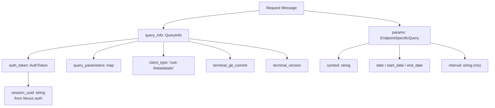

Authentication is **in-band** -- the session UUID is inside the protobuf message, not in gRPC metadata headers.

### Response Structure

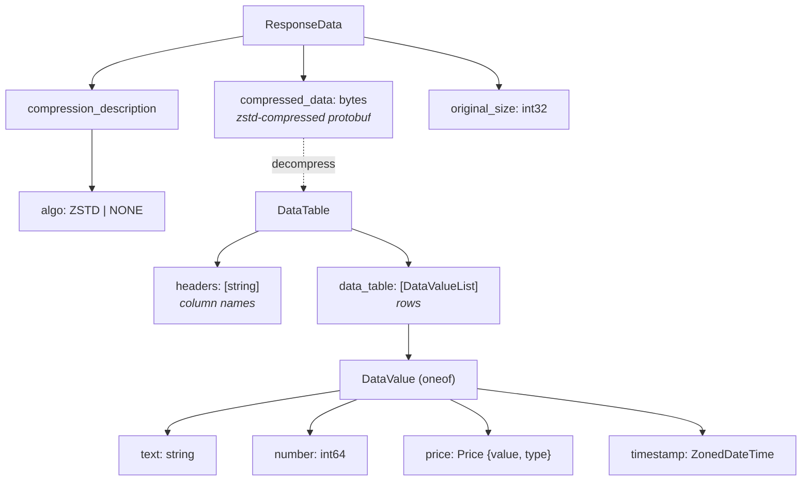

### Response Processing Pipeline

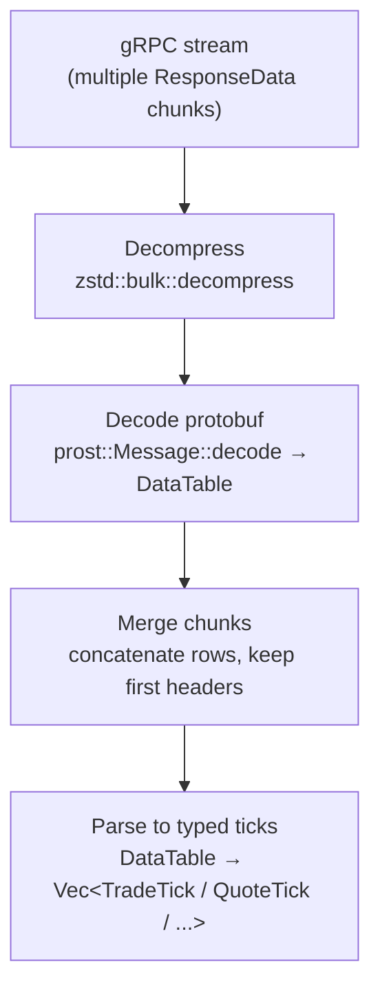

## FPSS Protocol (Real-Time Streaming)

FPSS is a custom binary protocol over TLS/TCP.

### Connection Establishment

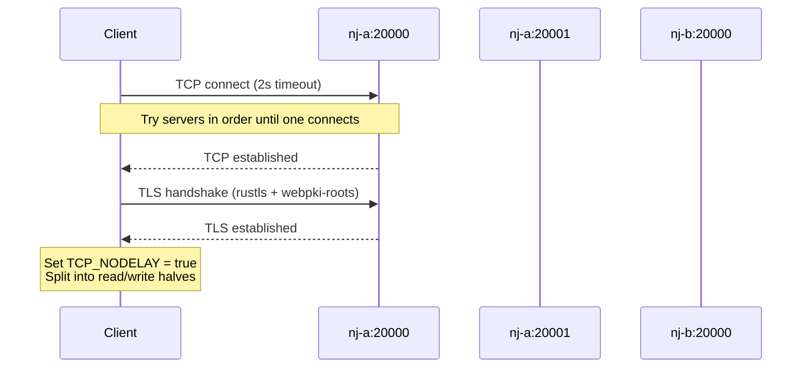

### Wire Framing

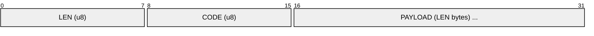

- **LEN**: Payload length (0-255). Does NOT include the 2-byte header.
- **CODE**: Message type (`StreamMsgType` enum).
- **PAYLOAD**: LEN bytes of message-specific data.

Total bytes per message on the wire = `LEN + 2`.

### Message Codes

| Code | Name | Direction | Description |
|------|------|-----------|-------------|
| 0x00 | CREDENTIALS | Client->Server | Auth: `[0x00] [user_len: u16 BE] [user bytes] [pass bytes]` |
| 0x01 | SESSION_TOKEN | Client->Server | Alternative session-based auth |
| 0x02 | INFO | Server->Client | Server info |
| 0x03 | METADATA | Server->Client | Login success, payload = permissions UTF-8 string |
| 0x04 | CONNECTED | Server->Client | Connection acknowledged |
| 0x0A | PING | Client->Server | Heartbeat: `[0x00]` every 100ms |
| 0x0B | ERROR | Server->Client | Error message (UTF-8 text) |
| 0x0C | DISCONNECTED | Server->Client | Disconnect reason: `[reason: i16 BE]` |
| 0x0D | RECONNECTED | Server->Client | Reconnection acknowledged |
| 0x14 | CONTRACT | Server->Client | Contract ID assignment: `[id: i32 BE] [contract bytes]` |
| 0x15 | QUOTE | Both | Subscribe(C->S) / data(S->C). FIT-encoded quote tick |
| 0x16 | TRADE | Both | Subscribe(C->S) / data(S->C). FIT-encoded trade tick |
| 0x17 | OPEN_INTEREST | Both | Subscribe(C->S) / data(S->C) |
| 0x18 | OHLCVC | Server->Client | FIT-encoded OHLC + volume + count snapshot |
| 0x1E | START | Server->Client | Market open signal |
| 0x1F | RESTART | Server->Client | Server restart signal |
| 0x20 | STOP | Both | Market close(S->C) / shutdown(C->S) |
| 0x28 | REQ_RESPONSE | Server->Client | Subscription result: `[req_id: i32 BE] [code: i32 BE]` |
| 0x33 | REMOVE_QUOTE | Client->Server | Unsubscribe quotes |
| 0x34 | REMOVE_TRADE | Client->Server | Unsubscribe trades |
| 0x35 | REMOVE_OI | Client->Server | Unsubscribe open interest |

### Auth Handshake

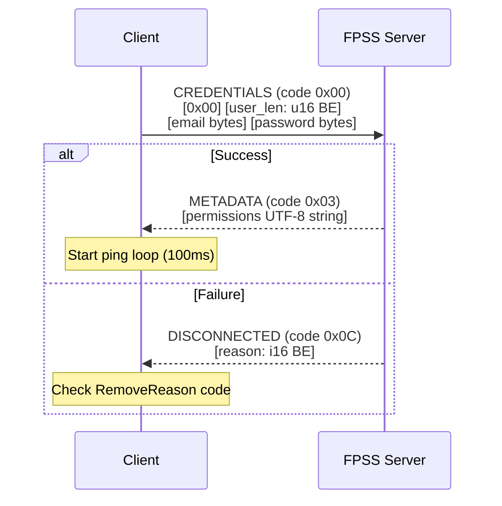

### Subscription Flow

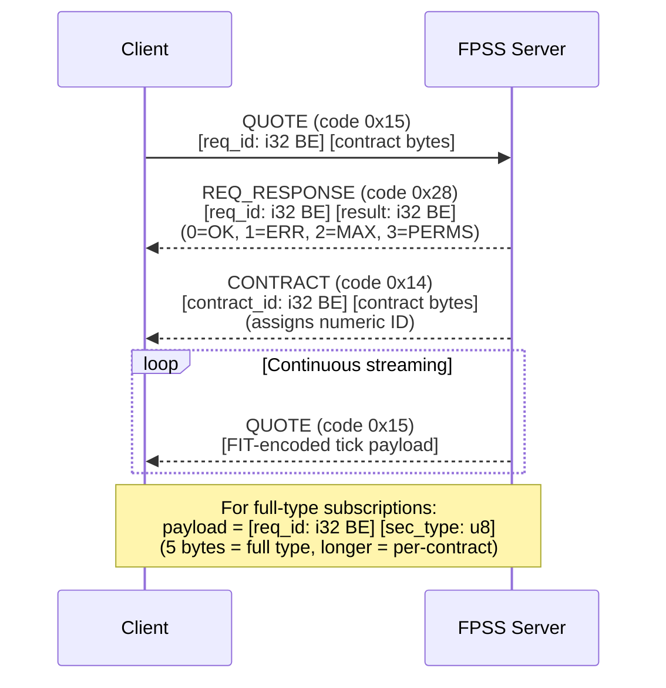

### Contract Binary Format

Contracts are serialized differently for equities vs options:

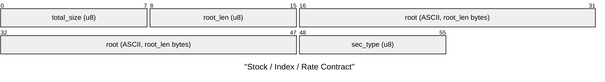

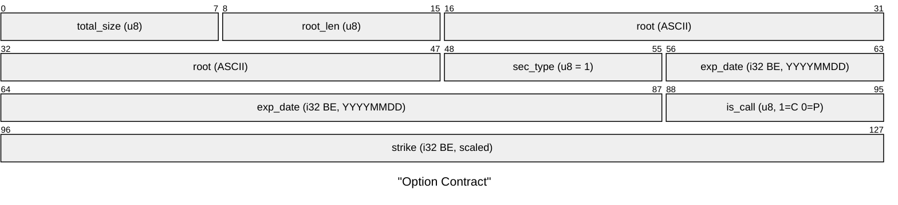

Security type codes: Stock=0, Option=1, Index=2, Rate=3.

### Heartbeat

After successful authentication, the client must send a PING (code 0x0A) with payload `[0x00]` every 100ms. Failure to send pings causes the server to disconnect.

### Disruptor Ring Buffer (perf branch)

The `perf` branch replaces the default `tokio::mpsc` channel for FPSS event dispatch with a lock-free disruptor ring buffer (`disruptor-rs` v4), matching Java's LMAX Disruptor pattern. This eliminates channel overhead on the hot path and provides bounded-latency event delivery. The `main` branch retains `tokio::mpsc` for simplicity.

### Reconnection

| Disconnect Reason | Action |
|-------------------|--------|
| Credential/account errors (0, 1, 2, 6, 9, 17, 18) | **Permanent** -- do NOT reconnect |
| `TooManyRequests` (12) | Wait 130 seconds, then reconnect |
| All others | Wait 2 seconds, then reconnect |

Permanent reasons: `InvalidCredentials` (0), `InvalidLoginValues` (1), `InvalidLoginSize` (2), `AccountAlreadyConnected` (6), `FreeAccount` (9), `ServerUserDoesNotExist` (17), `InvalidCredentialsNullUser` (18).

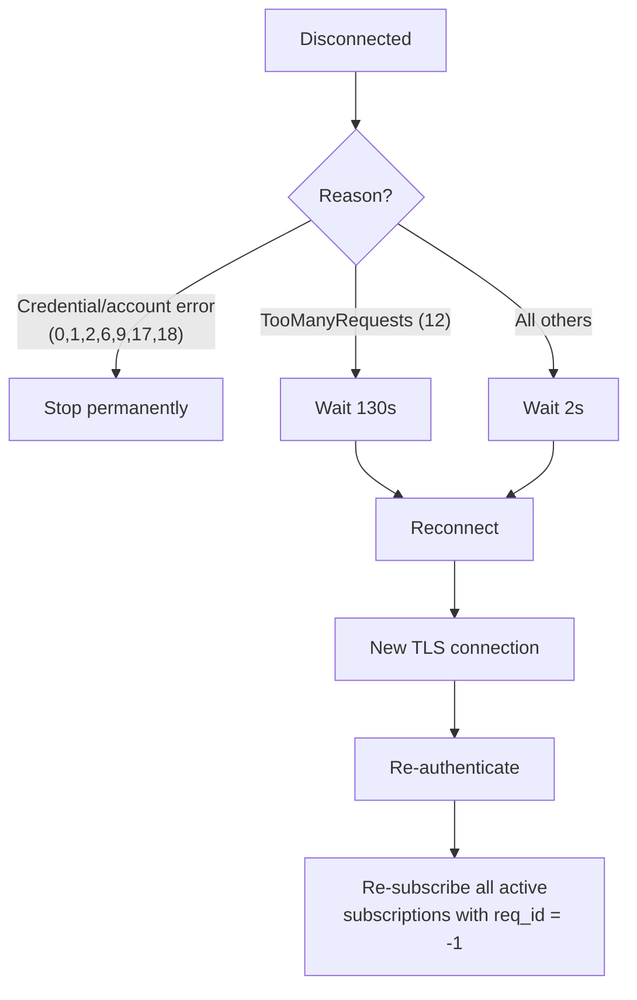

### Disconnect Reason Codes

| Code | Name |
|------|------|
| -1 | Unspecified |
| 0 | InvalidCredentials |
| 1 | InvalidLoginValues |
| 2 | InvalidLoginSize |
| 3 | GeneralValidationError |
| 4 | TimedOut |
| 5 | ClientForcedDisconnect |
| 6 | AccountAlreadyConnected |
| 7 | SessionTokenExpired |
| 8 | InvalidSessionToken |
| 9 | FreeAccount |
| 12 | TooManyRequests |
| 13 | NoStartDate |
| 14 | LoginTimedOut |
| 15 | ServerRestarting |
| 16 | SessionTokenNotFound |
| 17 | ServerUserDoesNotExist |
| 18 | InvalidCredentialsNullUser |

## FIT Tick Encoding

FPSS tick data uses **FIT** (Feed Interchange Transport) -- a nibble-based variable-length integer encoding with delta compression.

### Nibble Values

Each byte contains two 4-bit nibbles: `byte = (high << 4) | low`.

| Nibble | Meaning |
|--------|---------|
| 0-9 | Decimal digit, accumulated left-to-right into current integer |
| 0xB | FIELD_SEPARATOR -- flush integer to output, advance to next field |
| 0xC | ROW_SEPARATOR -- flush, zero-fill fields up to index 4, jump to index 5 |
| 0xD | END -- flush current integer, terminate row, return field count |
| 0xE | NEGATIVE -- next flushed integer is negated |

### Encoding Example

The value sequence `[34200000, 1, 0, 0, 0, 100, 4, 15025]` encodes as:

```
34200000 COMMA 1 SLASH 100 COMMA 4 COMMA 15025 END
```

Where SLASH (ROW_SEP) zero-fills fields 2-4 (ext_condition slots), jumping directly to field index 5.

### Delta Compression

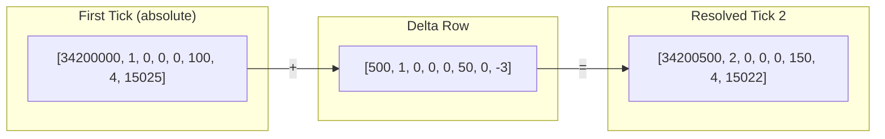

- **First tick** per contract: absolute values (no delta applied)
- **Subsequent ticks**: each field is a delta added to the previous tick's value
- Fields not present in the delta row carry forward from the previous tick

### Special: DATE Marker

If the first byte of a row is `0xCE` (DATE marker), the entire row is consumed until an END nibble is found, and `read_changes` returns 0. This signals a date boundary in the stream.

## Price Encoding

Prices in ThetaData use a fixed-point `(value, type)` encoding where the real price is:

```
real_price = value * 10^(type - 10)
```

| price_type | Decimal places | Multiplier | Example |
|------------|----------------|------------|---------|
| 0 | Zero price | 0 | `(0, 0)` = 0.0 |
| 6 | 4 decimals | 0.0001 | `(1502500, 6)` = 150.2500 |
| 7 | 3 decimals | 0.001 | `(5, 7)` = 0.005 |
| 8 | 2 decimals | 0.01 | `(15025, 8)` = 150.25 |
| 10 | 0 decimals | 1.0 | `(100, 10)` = 100.0 |
| 12 | -2 decimals | 100.0 | `(5, 12)` = 500.0 |

The `Price` struct provides `to_f64()` for float conversion and `Display` for formatted string output. Comparisons between prices of different types are handled by normalizing to a common base.

## FIE String Encoding

FIE (Feed Interchange Encoding) is the complementary encoder used for building FPSS request payloads. It maps a 16-character alphabet to 4-bit nibbles:

| Character | Nibble |
|-----------|--------|
| `0`-`9` | 0-9 |
| `.` | 0xA |
| `,` | 0xB |
| `/` | 0xC |
| `n` | 0xD (newline/end marker) |
| `-` | 0xE |
| `e` | 0xF |

Characters are packed pairwise: `byte = (nibble(c1) << 4) | nibble(c2)`. Odd-length strings pad the last byte with `0xD`. Even-length strings append a `0xDD` terminator.

## Module Architecture

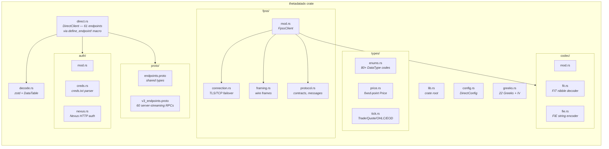
