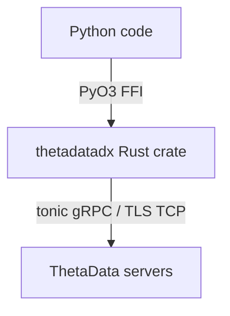

# thetadatadx (Python)

Python SDK for ThetaData market data, powered by the `thetadatadx` Rust crate via PyO3.

**This is NOT a Python reimplementation.** Every call goes through compiled Rust — gRPC communication, protobuf parsing, zstd decompression, FIT tick decoding, and TCP streaming all happen at native speed. Python is just the interface.

## Installation

```bash
pip install thetadatadx

# With pandas DataFrame support
pip install thetadatadx[pandas]
```

Or build from source (requires Rust toolchain):

```bash
pip install maturin
maturin develop --release
```

## Quick Start

```python
from thetadatadx import Credentials, Config, DirectClient

# Authenticate and connect
creds = Credentials.from_file("creds.txt")
client = DirectClient(creds, Config.production())

# Fetch end-of-day data
eod = client.stock_history_eod("AAPL", "20240101", "20240301")
for tick in eod:
    print(f"{tick['date']}: O={tick['open']:.2f} H={tick['high']:.2f} "
          f"L={tick['low']:.2f} C={tick['close']:.2f} V={tick['volume']}")

# Intraday 1-minute OHLC bars
bars = client.stock_history_ohlc("AAPL", "20240315", "60000")
print(f"{len(bars)} bars")

# Option chain
exps = client.option_list_expirations("SPY")
strikes = client.option_list_strikes("SPY", exps[0])
```

## Greeks Calculator

Full Black-Scholes calculator with 22 Greeks, running in Rust:

```python
from thetadatadx import all_greeks, implied_volatility

# All Greeks at once
g = all_greeks(
    spot=450.0, strike=455.0, rate=0.05, div_yield=0.015,
    tte=30/365, option_price=8.50, is_call=True
)
print(f"IV={g['iv']:.4f} Delta={g['delta']:.4f} Gamma={g['gamma']:.6f}")

# Just IV
iv, err = implied_volatility(450.0, 455.0, 0.05, 0.015, 30/365, 8.50, True)
```

## API

### `Credentials`
- `Credentials(email, password)` — direct construction
- `Credentials.from_file(path)` — load from creds.txt

### `Config`
- `Config.production()` — ThetaData NJ production servers
- `Config.dev()` — dev servers with shorter timeouts

### `DirectClient(creds, config)`
All methods return lists of dicts.

| Method | Description |
|--------|-------------|
| `stock_list_symbols()` | All stock symbols |
| `stock_history_eod(symbol, start, end)` | EOD data |
| `stock_history_ohlc(symbol, date, interval)` | Intraday OHLC |
| `stock_history_trade(symbol, date)` | All trades |
| `stock_history_quote(symbol, date, interval)` | NBBO quotes |
| `stock_snapshot_quote(symbols)` | Live quote snapshot |
| `option_list_expirations(symbol)` | Expiration dates |
| `option_list_strikes(symbol, exp)` | Strike prices |
| `option_list_symbols()` | Option underlyings |
| `index_list_symbols()` | Index symbols |

### `FpssClient(creds, buffer_size=1024)`
Real-time streaming client.

| Method | Description |
|--------|-------------|
| `subscribe(symbol, data_type)` | Subscribe to a stream (`"QUOTE"`, `"TRADE"`, `"OI"`) |
| `next_event(timeout_ms=5000)` | Poll for the next event (returns dict or None on timeout) |
| `shutdown()` | Graceful shutdown |

### `to_dataframe(data)`
Convert a list of tick dicts to a pandas DataFrame. Requires `pip install thetadatadx[pandas]`.

### `_df` method variants
All `DirectClient` data methods have `_df` variants that return DataFrames directly:
`stock_history_eod_df()`, `stock_history_ohlc_df()`, `stock_history_trade_df()`, etc.

### `all_greeks(spot, strike, rate, div_yield, tte, price, is_call)`
Returns dict with 22 Greeks: delta, gamma, theta, vega, rho, iv, vanna, charm, vomma, veta, speed, zomma, color, ultima, d1, d2, dual_delta, dual_gamma, epsilon, lambda.

### `implied_volatility(spot, strike, rate, div_yield, tte, price, is_call)`
Returns `(iv, error)` tuple.

## Architecture



No HTTP middleware, no Java terminal, no subprocess. Direct wire protocol access at Rust speed.

## FPSS Streaming

Real-time market data via ThetaData's FPSS servers:

```python
from thetadatadx import Credentials, FpssClient

creds = Credentials.from_file("creds.txt")
fpss = FpssClient(creds, buffer_size=1024)

# Subscribe to real-time quotes
fpss.subscribe("AAPL", "QUOTE")
fpss.subscribe("SPY", "TRADE")

# Poll for events
while True:
    event = fpss.next_event(timeout_ms=5000)
    if event is None:
        break  # timeout, no event received
    if event["type"] == "quote":
        print(f"Quote: {event['contract']} bid={event['bid']} ask={event['ask']}")
    elif event["type"] == "trade":
        print(f"Trade: {event['contract']} price={event['price']} size={event['size']}")

fpss.shutdown()
```

## pandas DataFrame Conversion

Convert any result to a pandas DataFrame:

```python
from thetadatadx import Credentials, Config, DirectClient, to_dataframe

creds = Credentials.from_file("creds.txt")
client = DirectClient(creds, Config.production())

# Option 1: convert an existing result
eod = client.stock_history_eod("AAPL", "20240101", "20240301")
df = to_dataframe(eod)
print(df.head())

# Option 2: use _df convenience methods
df = client.stock_history_eod_df("AAPL", "20240101", "20240301")
df = client.stock_history_ohlc_df("AAPL", "20240315", "60000")
df = client.option_list_expirations_df("SPY")
```

Install with: `pip install thetadatadx[pandas]`
